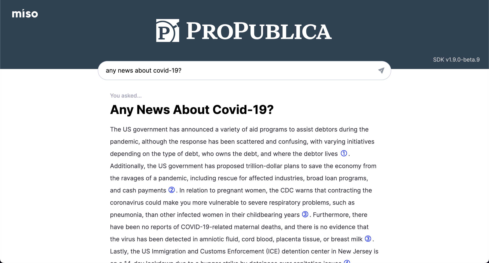
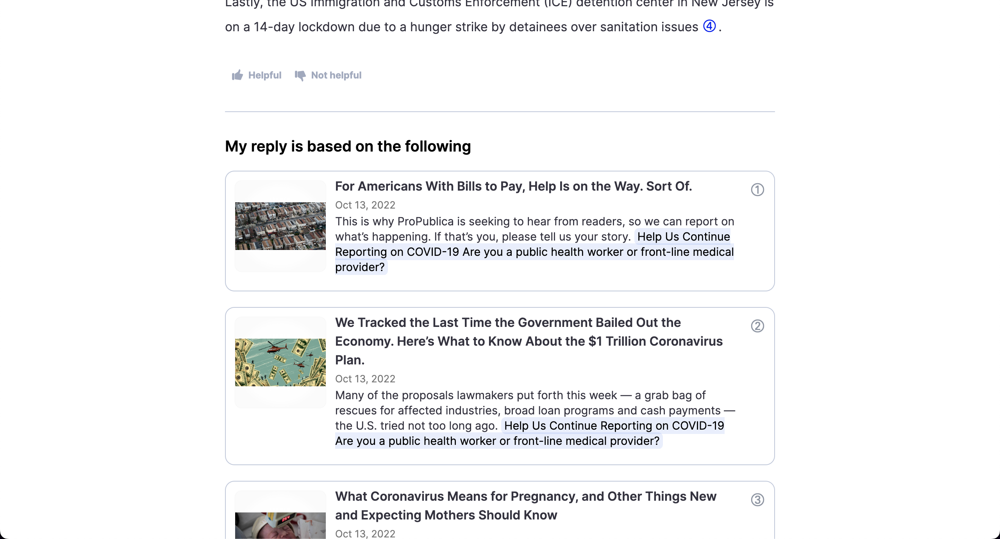
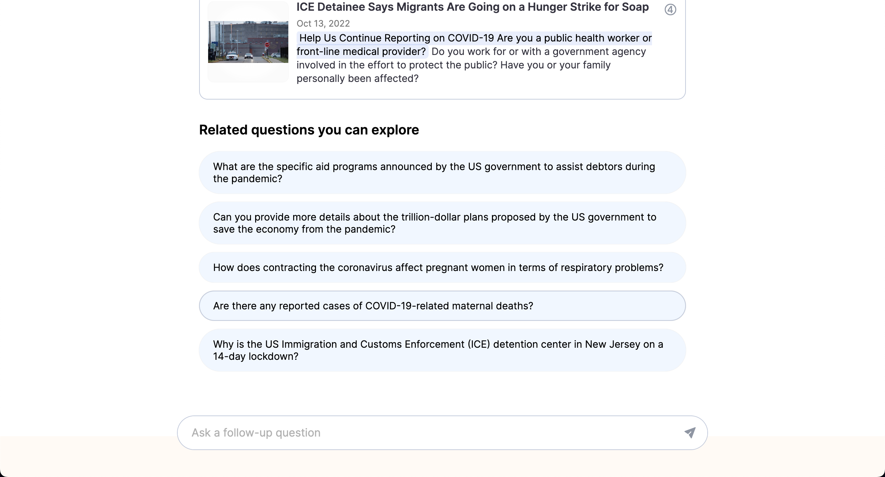

<div align="center">
  <div>
    <a href="https://miso.ai">
      
    </a>
  </div>
  <p>
    <strong>Private AI for the Open Web.</strong>
  </p>
  <p>
    <a href="https://www.npmjs.com/package/@miso.ai/client-sdk"></a>
    <a href="https://www.npmjs.com/package/@miso.ai/client-sdk"></a>
    <a href="/LICENSE"></a>
  </p>
  <a href="https://miso.ai/">Home</a> | <a href="https://answers.miso.ai/">Demo</a> | <a href="https://docs.miso.ai/">Docs</a> | <a href="https://misoai.github.io/miso-client-js-sdk/answers">SDK Reference</a> | <a href="https://api.askmiso.com/">API Reference</a>
</div>

----

With LLM technology today, your users want to engage your content in smarter ways in place of the traditional keyword search. Miso offers LLM answer API services with our private models and your controlled content source.

<table>
  <tbody>
    <tr>
      <td>
        
      </td>
      <td>
        
      </td>
    </tr>
    <tr>
      <td>
        
      </td>
      <td>
        
      </td>
    </tr>
  </tbody>
</table>

### Why Miso

- Citation-driven, i.e. no AI hallucinations
- Your own AI answer engine tuned to your content
- Designed to comply with your content guidelines

# Miso JavaScript SDK

Miso provides a JavaScript SDK for browser that gives you the power to integrate the full Miso Answers solution to your website in 10 minutes.

<div align="center">
  <a href="https://misoai.github.io/miso-client-js-sdk/demo/latest/answers/ask/">
    
  </a>
</div>

## Quick start

1. Log in Miso [dashboard](https://dojo.askmiso.com/) to obtain your publishable API key.
2. Add the SDK and element to your website.

```html
<head>
  <script async src="https://cdn.jsdelivr.net/npm/@miso.ai/client-sdk@1.9.0/dist/umd/miso.min.js?api_key={{api_key}}"></script>
</head>
<body>
  ...
  <miso-ask-combo></miso-ask-combo>
  ...
</body>
```

<div align="center">
  <a href="https://stackblitz.com/github/MisoAI/miso-sdk-docs/tree/main/examples/client/1.9/answers/ask/standard/basic">
    
  </a>
</div>

## Other SDKs
* [Node.js SDK](https://misoai.github.io/miso-server-js-sdk/sdk/)
* [Python SDK](https://misoai.github.io/miso-python-sdk/)

## Development
See [Development](./development.md).

## License
This library is distributed under the [MIT license](https://github.com/askmiso/miso-client-js-sdk/blob/main/LICENSE).
